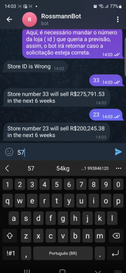
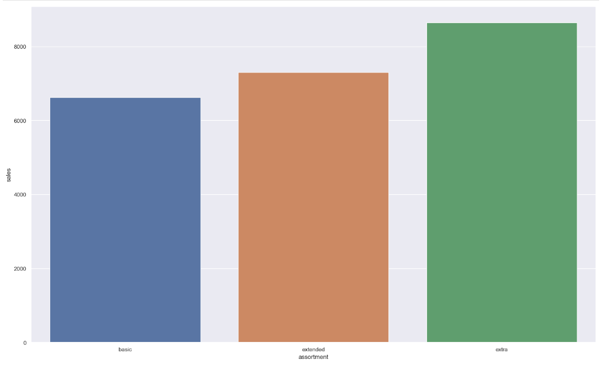
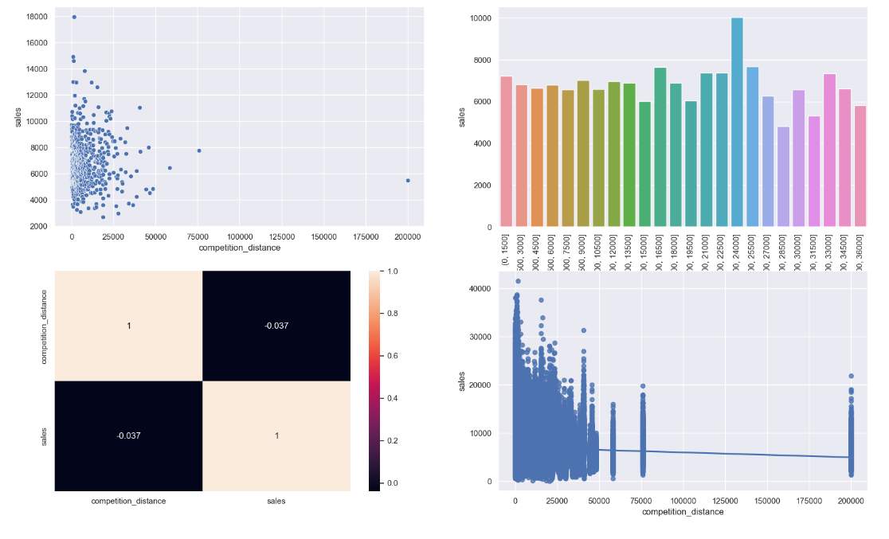
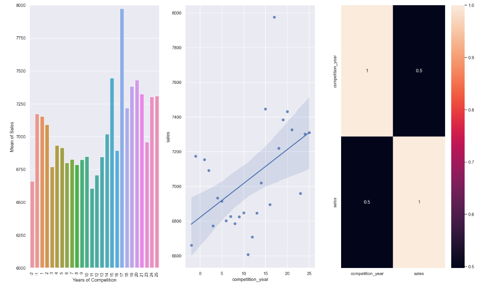
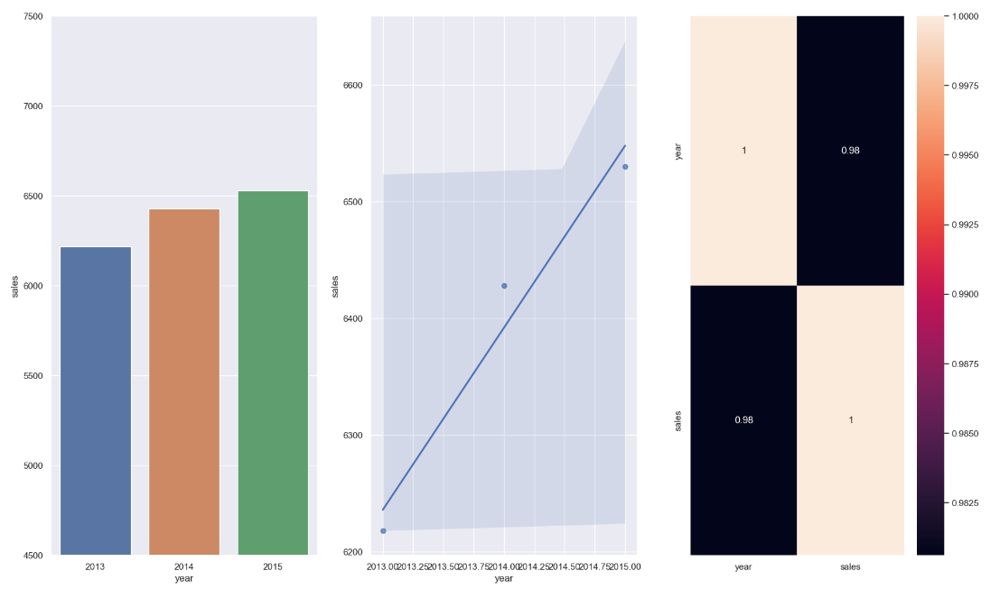
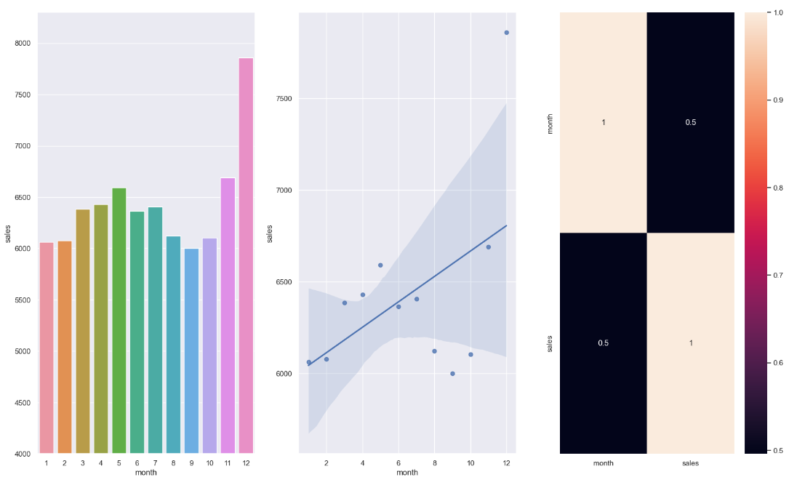

# 1.0. Introdução ao problema de negócio
A Rossmann é uma rede de drogarias com mais de 3.000 lojas ativas em 7 países europeus. O CFO da empresa planeja fazer uma reforma em cada loja, e em reunião com todos os gerentes indivíduais solicitou uma previsão das próximas 6 semanas de vendas de cada loja, pois com base nessas informações seria definido o total destinado a cada uma.

Como Cientistas de Dados da Rossmann, fomos acionados para trabalhar em uma solução.

## 1.1. Questões do negócio
Fazer uma predição das vendas de cada loja pelas próximas 6 semanas

# 2.0. Premissas do negócio
A coluna "Costumers" foi dropada pois é uma informação que não podemos ter no momento em que estivermos fazendo o treinamento do nosso modelo, já que não sabemos quantos clientes teremos nas nossas lojas ao longo das próximas 6 semanas

Os valores vazios da coluna "competition_distance" foram substituídos por 3 vezes o valor maximo do competidor mais distante. Estamos assumindo que se não temos essa informação, não temos competidores mais próximos e então estamos extrapolando no valor dos dados faltantes.

# 3.0. Planejamento da Solução
## 3.1. Entrega Final
A entrega será de um Bot no Telegram, que opere 24/7 e seja capaz de devolver a soma total da predição das próximas 6 semanas de vendas da loja requisitada.

<h1 align="center"></h1>

## 3.2. Algumas ferramentas ultilizadas

- [Python 3.8.15](https://www.python.org/downloads/release/python-3815/)
- [Jupyter Notebook](https://jupyter.org/)
- [Scikit Learn](https://scikit-learn.org/0.21/documentation.html) and [XGBoost](https://xgboost.readthedocs.io/en/stable/)
- Boruta
- [Git](https://git-scm.com/) and [Github](https://github.com/)
- [Render](https://render.com/)
- [Telegram Bot](https://core.telegram.org/bots/api)
- [Flask](https://flask.palletsprojects.com/en/2.2.x/)

### 3.3. Processo até a solução

Iremos utilizar o método CRISP-DS ao longo do projeto, seguindo todas as suas etapas e visando uma primeira entrega mais
rápida porem mantendo uma boa qualidade, posteriormente poderemos voltar para o inicio do ciclo novamente afim de implementar novas tecnicas e melhorias no projeto caso o resultado final ainda não esteja satisfatório.

- **Business Problem:** Etapa em que é feito um pedido ou pergunta por parte do dono do problema.

- **Business Understand:** Entender mais sobre a motivação do CFO por trás da solicitação da predição de vendas.

- **Data Collect:** Fazer a coleta dos dados da Rossmann no [Kaggle](https://www.kaggle.com/c/rossmann-store-sales)

- **Data Cleaning:** Realizar o tratamento dos dados faltantes no nosso conjunto de dados.

- **Data Description:** Entender o quão desafiador é o problema que temos em mãos, conseguiremos responder se temos recursos para trabalhar, quais sãos os tipos de variaveis que temos , qual porcentagem de cada tipo, a quantidade de dados faltantes e a estatistica descritiva dos dados.

- **Feature Engineering:** Derivação de novas features através das originais, que irão nos ajudar na melhoria do modelo de ML, alem de ser parte importante para a validação das hipoteses levantadas e insights para o negócio.

- **EDA:** Entendimento de como as variáveis impactam no fenomeno de vendas, e qual a força desse impacto. Aqui ganhamos experiência do negócio, validaremos as hipoteses levantadas anteriormente e com isso iremos conseguir ter a percepção de quais variáveis são importantes para descrever nosso fenomeno.

- **Data Preparation:** Parte onde os dados são preparados para que possam ser recebidos pelo modelo de ML, dados categóricos e numéricos recebem diferentes tratamentos para que posssam ficar em uma escala numérica próxima.

- **Feature Selection:** Nesta etapa, devemos escolher as features que melhor descrevem o nosso fenomeno, dizemos que estas são as features mais relevantes para o aprendizado do nosso modelo. 

- **Machine Learning Modeling:** Neste projeto, escolhemos os principais algoritmos de Regressão para serem treinados com nossos dados. 

- **Hyperparameter Fine Tunning:** Utilizado a tecnica de Random Search para escolher os melhores parametros para performance do algoritmo escolhido.

- **Avaliação do modelo:** Utilizado as metricas de MAE, MAPE e RMSE para checar a performance do algoritmo.

- **Resultados financeiros:** Tradução do resultado do modelo para um resultado financeiro, tornando fácil o entendimento dos resultados.

- **Deploy para produção:** Criação de um Bot do Telegram que seja capaz de me dar o resultado da predição a partir do numero da loja escolhida. 

## 4.0. Os 5 principais insights do negócio

- ### **H1:** Lojas com maior sortimento, na média, vendem mais
<h1 align="center"></h1>

- ### **H2:** Lojas com competidores mais próximos vendem um pouco a mais
<h1 align="center"></h1>

- ### **H3:** Lojas com competidores por mais tempo vendem mais
<h1 align="center"></h1>

- ### **H4:** Lojas vendem mais durante os anos
<h1 align="center"></h1>

- ### **H5:** Lojas vendem mais no segundo semestre do ano, principalmente em dezembro
<h1 align="center"></h1>
